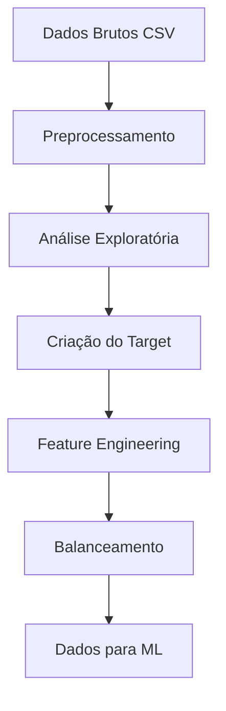

# Sistema de Análise de Viabilidade Jurídica SINDEC

Sistema modular para análise e classificação de viabilidade jurídica de dados do SINDEC (Sistema Nacional de Informações de Defesa do Consumidor).

## 📋 Funcionalidades

- **Processamento de dados SINDEC**: Carregamento, limpeza e preparação dos dados
- **Enriquecimento via API DataJud**: Busca valores reais de processos do CNJ (opcional)
- **Estimativa de valores de causa**: Sistema backup baseado em dados históricos
- **Análise de viabilidade**: Classificação automatizada de causas jurídicas
- **Relatórios e visualizações**: Análises completas com gráficos interativos

## 🚀 Instalação

1. Clone o repositório:
```bash
git clone <seu-repositorio>
cd sindec-analyzer
```

2. Instale as dependências:
```bash
pip install -r requirements.txt
```

## 📁 Estrutura do Projeto

```
sindec-analyzer/
├── config.py              # Configurações do sistema
├── data_processor.py      # Processamento de dados SINDEC
├── datajud_enricher.py    # Enriquecimento via API DataJud
├── valor_estimator.py     # Estimativa de valores de causa
├── analyzer.py            # Análise e visualização
├── main.py               # Script principal
├── requirements.txt      # Dependências Python
└── README.md            # Este arquivo
```

## 🔧 Configuração

### 1. Arquivo de Dados
Coloque o arquivo CSV do SINDEC no diretório raiz do projeto. Por padrão, o sistema procura por `PROCON_2017_21.csv`.

### 2. API DataJud (Opcional)
Para usar o enriquecimento com dados reais do CNJ:

1. Obtenha uma chave API em: https://www.cnj.jus.br/sistemas/datajud/api-publica/
2. Configure a variável `API_KEY` no arquivo `main.py`

```python
API_KEY = "sua_chave_api_aqui"
```

## 🎯 Uso

### Execução Completa
```bash
python main.py
```

### Uso Modular

```python
from main import SindecProcessor

# Inicializa processador
processor = SindecProcessor(api_key="sua_api_key")  # API key opcional

# Processa arquivo
df_resultado = processor.processar_completo("seu_arquivo.csv")
```

### Análise de Viabilidade Individual

```python
from analyzer import ViabilityChecker

checker = ViabilityChecker()
resultado = checker.analisar_viabilidade(
    valor=5000,
    tipo_assunto="Energia Elétrica",
    problema="Cobrança Indevida",
    regiao="Sudeste",
    uf="SP"
)
```

### Estimativa de Valores

```python
from valor_estimator import ValorCausaEstimatorBackup

estimador = ValorCausaEstimatorBackup()
estimativa = estimador.estimar_valor_causa(
    descricao_assunto="Telefonia Celular",
    descricao_problema="Cobrança indevida",
    uf="SP",
    ano=2021
)
```

## 📊 Saídas

O sistema gera os seguintes arquivos:

- **`SINDEC_com_valores_causa.csv`**: Dataset completo com valores estimados
- **`SINDEC_resumo_por_assunto.csv`**: Resumo estatístico por assunto

## 🔍 Análise de Viabilidade

O sistema classifica automaticamente as causas em:

- **✅ VIÁVEL**: Recomenda aceitar a causa
- **⚠️ MODERADA**: Recomenda análise detalhada
- **❌ NÃO VIÁVEL**: Recomenda rejeitar a causa

### Fatores Considerados

1. **Valor da causa**: Valores mais altos aumentam viabilidade
2. **Região geográfica**: Algumas regiões têm jurisprudência mais favorável
3. **Tipo de assunto**: Setores com boa jurisprudência (energia, telefonia, bancos)
4. **Tipo de problema**: Problemas com alta taxa de sucesso histórica

## 📈 Dados Históricos

O sistema utiliza base de dados históricos incluindo:

- Análises do TJSP e outros tribunais
- Estudos da ANATEL, BACEN, ANEEL, ANS
- Jurisprudência do STJ
- Dados do PROCON e SENACON

## ⚙️ Configurações Avançadas

Edite o arquivo `config.py` para personalizar:

- URLs da API DataJud
- Parâmetros de processamento
- Nomes de arquivos de saída
- Configurações de encoding

## 🐛 Solução de Problemas

### Erro de Arquivo Não Encontrado
```
❌ Arquivo não encontrado: PROCON_2017_21.csv
```
**Solução**: Certifique-se de que o arquivo CSV está no diretório correto.

### Erro de Encoding
```
UnicodeDecodeError: 'utf-8' codec can't decode
```
**Solução**: O sistema está configurado para `windows-1252`. Verifique o encoding do seu arquivo.

### API DataJud Indisponível
```
❌ Erro na conexão com API DataJud
```
**Solução**: O sistema continuará funcionando com estimativas baseadas em dados históricos.

## 📝 Exemplo de Saída

```
🎯 EXEMPLO: ANÁLISE DE VIABILIDADE
--------------------------------------------------
⚠️ Modelo não encontrado. Usando análise por regras.

✅ CAUSA VIÁVEL
Recomendação: ACEITAR esta causa

📊 Probabilidade VIÁVEL: 66.7%
📊 Probabilidade NÃO VIÁVEL: 33.3%
📊 Score de Viabilidade: 60/90

🎯 FATORES INFLUENCIADORES:
==================================================
 1. ⚠️ Valor Médio (R$ 2.000-5.000) - Moderadamente favorável
 2. ⚠️ Região Nordeste - Desafios regionais
 3. ⚠️ Energia Elétrica - Setor com boa jurisprudência
 4. ✅ Cobrança Indevida - Alta taxa de sucesso histórica

📋 MÉTODO: Análise por Regras de Negócio
🎯 CONFIANÇA: 66.7%
```

## 🤝 Contribuições

1. Fork o projeto
2. Crie uma branch para sua feature (`git checkout -b feature/nova-feature`)
3. Commit suas mudanças (`git commit -m 'Adiciona nova feature'`)
4. Push para a branch (`git push origin feature/nova-feature`)
5. Abra um Pull Request

## 📄 Licença

Este projeto está sob a licença MIT. Veja o arquivo `LICENSE` para mais detalhes.

## 📞 Suporte

Para dúvidas ou problemas:
1. Verifique a seção de Solução de Problemas
2. Abra uma issue no GitHub
3. Consulte a documentação das APIs utilizadas


##########################################################################################################################

# Sistema de Classificação de Viabilidade de Causas Jurídicas

Este projeto implementa um sistema de machine learning para classificar a viabilidade financeira de causas jurídicas baseado em dados do SINDEC (Sistema Nacional de Informações de Defesa do Consumidor).

## 📋 Visão Geral

O sistema analisa descrições de assuntos e problemas de reclamações de consumidores para determinar se uma causa é **VIÁVEL** ou **NÃO VIÁVEL** financeiramente para escritórios de advocacia.

### 🎯 Objetivo

Criar um modelo que classifique automaticamente a viabilidade de causas baseado em:
- Descrição do assunto
- Descrição do problema  
- Valor estimado da causa
- Taxa de sucesso histórica
- Dados regionais e demográficos

## 🏗️ Arquitetura do Sistema

```
├── config.py              # Configurações gerais
├── data_preprocessing.py   # Limpeza e preprocessamento
├── exploratory_analysis.py # Análise exploratória  
├── target_creation.py      # Criação da variável target
├── feature_engineering.py  # Engenharia de features
├── data_balancing.py       # Balanceamento de dados
├── utils.py               # Funções utilitárias
├── main.py                # Pipeline principal
├── requirements.txt       # Dependências
└── README.md             # Esta documentação
```

## 🚀 Instalação

### Pré-requisitos

- Python 3.8+
- Git

### Configuração

1. **Clone o repositório:**
```bash
git clone <url-do-repositorio>
cd viabilidade-causas-juridicas
```

2. **Crie um ambiente virtual:**
```bash
python -m venv venv
source venv/bin/activate  # Linux/Mac
# ou
venv\Scripts\activate     # Windows
```

3. **Instale as dependências:**
```bash
pip install -r requirements.txt
```

## 📊 Uso

### Execução Básica

```bash
python main.py dados_sindec.csv
```

### Execução Avançada

```bash
# Com TF-IDF (mais lento, mais features)
python main.py dados_sindec.csv --tfidf

# Com estratégia específica de balanceamento
python main.py dados_sindec.csv --strategy moderate

# Combinando opções
python main.py dados_sindec.csv --tfidf --strategy aggressive
```

### Estratégias de Balanceamento

- **`auto`**: Seleção automática baseada no desbalanceamento
- **`conservative`**: Balanceamento suave (undersampling leve)
- **`moderate`**: Balanceamento médio (SMOTE) - **Recomendado**
- **`aggressive`**: Balanceamento agressivo (SMOTE + limpeza)

## 📁 Arquivos Gerados

Após a execução, o sistema gera:

- `dados_preprocessados.csv` - Dados após limpeza
- `dados_com_target.csv` - Dados com variável target criada
- `dados_com_features.csv` - Dados com features engineered
- `dados_balanceados.csv` - Dados finais prontos para ML
- `relatorio_qualidade.txt` - Relatório de qualidade dos dados

## 🔧 Módulos

### 1. data_preprocessing.py
**Funcionalidade:** Limpeza e preprocessamento dos dados brutos
- Remove valores inválidos da coluna 'Atendida'
- Trata valores nulos
- Valida consistência dos dados

### 2. exploratory_analysis.py  
**Funcionalidade:** Análise exploratória abrangente
- Estatísticas descritivas
- Análise por tipo de assunto/problema
- Identificação de padrões de viabilidade
- Insights preliminares

### 3. target_creation.py
**Funcionalidade:** Criação da variável target baseada em critérios de viabilidade
- Calcula estatísticas históricas por assunto
- Define critérios de viabilidade (valor, taxa de sucesso, etc.)
- Cria scores compostos e classificação final

### 4. feature_engineering.py
**Funcionalidade:** Criação de features para machine learning
- Features de texto (comprimento, palavras-chave jurídicas)
- Features categóricas (região, empresa, temporais)
- Features numéricas (transformações de valor)
- TF-IDF opcional para análise avançada de texto

### 5. data_balancing.py
**Funcionalidade:** Balanceamento de classes para ML
- Múltiplas estratégias (SMOTE, undersampling, híbridas)
- Avaliação comparativa de estratégias
- Balanceamento adaptativo

### 6. utils.py
**Funcionalidade:** Funções utilitárias
- Debug de DataFrames
- Relatórios de qualidade
- Visualizações
- Validações

## 📈 Pipeline de Processamento



### Etapas Detalhadas:

1. **Preprocessamento**: Limpeza básica, remoção de inconsistências
2. **Análise Exploratória**: Compreensão dos padrões nos dados
3. **Criação do Target**: Definição de critérios de viabilidade
4. **Feature Engineering**: Criação de features preditivas
5. **Balanceamento**: Correção do desbalanceamento de classes
6. **Output**: Dados prontos para treinamento de modelos

## 🎯 Critérios de Viabilidade

O sistema classifica uma causa como **VIÁVEL** baseado em:

### Scores Componentes (0-10 pontos):
- **Score Valor** (0-3): Baseado no valor da causa
- **Score Sucesso** (0-3): Taxa de sucesso histórica do tipo de assunto  
- **Score Potencial** (0-2): Potencial financeiro esperado
- **Score Confiança** (0-1): Confiabilidade da estimativa
- **Score Volume** (0-1): Volume histórico de casos similares

### Classificação Final:
- **Score ≥ 7**: ALTA viabilidade
- **Score 5-6**: MÉDIA viabilidade  
- **Score 3-4**: BAIXA viabilidade
- **Score < 3**: NÃO VIÁVEL

**Target Binário para ML**: Score ≥ 5 = VIÁVEL (1), Score < 5 = NÃO VIÁVEL (0)

## 🔍 Features Criadas

### Features de Texto:
- Comprimento de assunto/problema
- Contagem de palavras-chave jurídicas
- Scores de gravidade e complexidade
- Detecção de tipos de problema (dano moral, cobrança indevida, etc.)
- Identificação de setores (financeiro, telecom, etc.)

### Features Categóricas:
- Encoding de UF e região
- Características demográficas do consumidor
- Features temporais (mês, trimestre, sazonalidade)
- Características da empresa (porte, setor)

### Features Numéricas:
- Transformações logarítmicas de valores
- Faixas de valor categorizadas
- Scores de confiabilidade
- Ratios e comparações

## ⚙️ Configuração

Principais configurações em `config.py`:

```python
RANDOM_STATE = 42          # Reprodutibilidade
MAX_FEATURES_TFIDF = 100   # Máximo features TF-IDF
MIN_DF = 5                 # Mínimo documentos para TF-IDF
MAX_DF = 0.8              # Máximo % documentos para TF-IDF
```

## 📊 Exemplo de Saída

```
🎯 EXECUTANDO PIPELINE COMPLETO DE CLASSIFICAÇÃO DE VIABILIDADE
================================================================================

📂 CARREGANDO DADOS
===============================
✅ Dados carregados: (50482, 32)

🔄 ETAPA 1: PREPROCESSAMENTO
✅ dados_preprocessados.csv salvo

🔄 ETAPA 2: ANÁLISE EXPLORATÓRIA  
📊 Total de registros: 50,482
📊 Taxa de sucesso: 59.5%
💰 Valor médio: R$ 2,656.98

🔄 ETAPA 3: CRIAÇÃO DO TARGET
📊 Distribuição do Target Binário:
   VIÁVEL: 42,200 (83.6%)
   NÃO VIÁVEL: 8,282 (16.4%)

🔄 ETAPA 4: FEATURE ENGINEERING
📊 Features criadas: 45
📊 Shape final: (50482, 77)

🔄 ETAPA 5: BALANCEAMENTO DE DADOS
📊 Estratégia automática selecionada: MODERATE
📊 Amostras balanceadas: 67,344

🎯 DADOS PRONTOS PARA MACHINE LEARNING!
   Shape X: (67344, 45)
   Shape y: (67344,)
```

## 🤝 Uso dos Dados Processados

Após executar o pipeline, você pode usar os dados para ML:

```python
import pandas as pd
from sklearn.ensemble import RandomForestClassifier
from sklearn.model_selection import train_test_split

# Carrega dados balanceados
df = pd.read_csv('dados_balanceados.csv')
X = df.drop('target', axis=1)
y = df['target']

# Split treino/teste
X_train, X_test, y_train, y_test = train_test_split(
    X, y, test_size=0.2, random_state=42, stratify=y
)

# Treina modelo
model = RandomForestClassifier(random_state=42)
model.fit(X_train, y_train)

# Avalia
score = model.score(X_test, y_test)
print(f"Acurácia: {score:.3f}")
```

## 📝 Licença

Este projeto está licenciado sob a MIT License.

## 🐛 Problemas Conhecidos

- TF-IDF pode ser lento para datasets grandes (>10k linhas)
- Balanceamento agressivo pode gerar overfitting
- Requer ajuste fino dos critérios de viabilidade por domínio

## 🔮 Próximos Passos

- Implementação de modelos de ML (Random Forest, XGBoost, etc.)
- Sistema de avaliação e métricas
- Interface web para predições
- API REST para integração
- Monitoramento de drift dos dados

---

**Desenvolvido para classificação de viabilidade de causas jurídicas usando dados do SINDEC**

##########################################################################################################################

# Algoritmo de Classificação SINDEC - Parte 3

Módulo para balanceamento de dados e treinamento de modelos de classificação para análise de viabilidade jurídica.

## Instalação

```bash
pip install -r requirements.txt
```

## Estrutura do Projeto

```
├── config.py              # Configurações e constantes
├── data_preparation.py     # Preparação de dados para balanceamento
├── balancing.py           # Funções principais de balanceamento
├── clean_features.py      # Criação de features limpas (sem data leakage)
├── model_training.py      # Treinamento de modelos
├── main.py               # Arquivo principal e orquestração
├── requirements.txt      # Dependências
└── README.md            # Este arquivo
```

## Uso Básico

### 1. Pipeline Completo (Recomendado)

```python
from main import executar_pipeline_completo

# Executa análise completa com balanceamento e treinamento
resultados = executar_pipeline_completo(
    df_com_target,
    strategy='moderate',
    run_analysis=True
)

# Acessa resultados
melhor_modelo = resultados['best_model']['model']
df_balanceado = resultados['data']['df_balanced']
```

### 2. Pipeline Simplificado (Mais Rápido)

```python
from main import executar_pipeline_simples

# Execução mais rápida sem análise detalhada
resultados = executar_pipeline_simples(
    df_com_target,
    strategy='moderate'
)

melhor_modelo = resultados['best_model']
```

### 3. Uso Modular

```python
# Apenas balanceamento
from balancing import aplicar_balanceamento_sindec
df_balanced, results = aplicar_balanceamento_sindec(df_com_target)

# Apenas treinamento de modelos limpos
from model_training import treinar_modelo_limpo
resultados, X_train, X_test, y_train, y_test, features = treinar_modelo_limpo(df_balanced)
```

### 4. Salvar e Carregar Modelo

```python
from main import salvar_modelo_final, carregar_modelo_final, fazer_predicao

# Salvar modelo treinado
salvar_modelo_final(melhor_modelo, feature_names, 'meu_modelo.pkl')

# Carregar modelo
modelo_data = carregar_modelo_final('meu_modelo.pkl')

# Fazer predições
predicoes, probabilidades = fazer_predicao(modelo_data, dados_novos)
```

## Estratégias de Balanceamento

- `'conservative'`: Balanceamento conservador
- `'moderate'`: Balanceamento moderado (padrão)
- `'aggressive'`: Balanceamento agressivo
- `'auto'`: Seleciona automaticamente a melhor estratégia

## Dependências Externas

⚠️ **IMPORTANTE**: Este módulo depende da classe `DataBalancer` que deve ter sido criada nas partes 1 e 2 do algoritmo. Certifique-se de que as partes anteriores foram executadas antes de usar este módulo.

## Features Utilizadas

O módulo automaticamente:
- Remove features que causam data leakage
- Cria features geográficas, demográficas e temporais
- Aplica transformações de valor e encoding categórico
- Seleciona apenas features numéricas para ML

## Modelos Treinados

- Random Forest Classifier
- Gradient Boosting Classifier  
- Logistic Regression

O melhor modelo é selecionado automaticamente baseado na métrica AUC.

## Exemplo Completo

```python
import pandas as pd
from main import executar_pipeline_completo, salvar_modelo_final

# Carrega dados com target já criado
df_com_target = pd.read_csv('dados_com_target.csv')

# Executa pipeline completo
print("Executando pipeline completo...")
resultados = executar_pipeline_completo(
    df_com_target,
    strategy='moderate',
    run_analysis=True
)

# Salva melhor modelo
if resultados:
    melhor_modelo = resultados['best_model']['model']
    feature_names = resultados['data']['feature_names']
    
    salvar_modelo_final(melhor_modelo, feature_names)
    print(f"✅ Pipeline concluído! Melhor modelo: {resultados['best_model']['name']}")
```

## Troubleshooting

### Erro: "DataBalancer não encontrado"
- Execute as partes 1 e 2 do algoritmo primeiro
- Certifique-se de que a classe DataBalancer está disponível no ambiente

### Erro: "Coluna 'Viavel' não encontrada"
- Verifique se o target foi criado corretamente nas etapas anteriores
- O DataFrame de entrada deve conter a coluna 'Viavel' com valores 0/1

### Performance baixa do modelo
- Verifique a qualidade dos dados de entrada
- Considere ajustar a estratégia de balanceamento
- Execute análise completa para identificar problemas

#########################################################################################################################

# ⚖️ Sistema de Análise de Viabilidade Jurídica

Sistema inteligente para análise de viabilidade de causas jurídicas baseado em Machine Learning.

## 📋 Funcionalidades

- 🔍 **Análise Individual**: Análise detalhada de uma causa específica
- 📊 **Análise em Lote**: Processamento de múltiplas causas via CSV
- 📈 **Dashboard**: Insights e estatísticas do sistema
- ℹ️ **Informações**: Documentação completa do sistema

## 🚀 Instalação

### Pré-requisitos
- Python 3.8+
- pip

### Passos de Instalação

1. **Clone o repositório**
```bash
git clone <seu-repositorio>
cd juridical-analyzer
```

2. **Crie um ambiente virtual**
```bash
python -m venv venv
source venv/bin/activate  # Linux/Mac
# ou
venv\Scripts\activate  # Windows
```

3. **Instale as dependências**
```bash
pip install -r requirements.txt
```

## 🎯 Como Usar

### 1. Preparar o Modelo
Antes de executar a aplicação, você precisa ter o modelo treinado:

```python
# Código para salvar o modelo após treinamento:
import pickle

model_data = {
    'model': modelo,  # Seu modelo treinado
    'feature_names': feature_names,  # Lista de nomes das features
    'scaler': scaler  # Scaler se usado (opcional)
}

with open('modelo_viabilidade_final.pkl', 'wb') as f:
    pickle.dump(model_data, f)
```

### 2. Executar a Aplicação
```bash
streamlit run app.py
```

### 3. Acessar o Sistema
- Abra o navegador em: `http://localhost:8501`
- Faça upload do modelo (se necessário)
- Use as funcionalidades disponíveis

## 📁 Estrutura do Projeto

```
juridical-analyzer/
│
├── app.py                      # Arquivo principal
├── juridical_analyzer.py       # Classe principal de análise
├── config.py                   # Configurações do sistema
├── requirements.txt            # Dependências
├── README.md                   # Este arquivo
│
├── utils/
│   ├── __init__.py
│   ├── styles.py              # Estilos CSS
│   └── model_handler.py       # Manipulação de modelos
│
└── pages/
    ├── __init__.py
    ├── individual_analysis.py  # Análise individual
    ├── batch_analysis.py       # Análise em lote
    ├── dashboard.py            # Dashboard
    └── about.py               # Sobre o sistema
```

## 💡 Uso da API

### Análise Individual
```python
from juridical_analyzer import JuridicalAnalyzer

analyzer = JuridicalAnalyzer()

input_data = {
    'tipo_assunto': 'Bancos/Financeiro',
    'valor_causa': 5000,
    'regiao': 'Sudeste',
    'uf': 'SP',
    'sexo': 'M',
    'faixa_etaria': 3,
    'ano': 2024
}

result = analyzer.predict_viability(input_data)
print(f"Viável: {result['prediction']}")
print(f"Probabilidade: {result['probability_viavel']:.2%}")
```

## 📊 Formato CSV para Análise em Lote

O arquivo CSV deve conter as seguintes colunas:
- `tipo_assunto`: Tipo do assunto
- `valor_causa`: Valor estimado da causa
- `regiao`: Região (Sudeste, Sul, etc.)
- `uf`: Unidade Federativa
- `sexo`: M ou F
- `faixa_etaria`: Número de 1-7
- `ano`: Ano da causa

## ⚖️ Considerações Legais

⚠️ **Importante**: Este sistema é uma ferramenta de apoio à decisão e não substitui a análise jurídica especializada.

## 🔧 Suporte

Para dúvidas ou problemas técnicos, abra uma issue no repositório.

